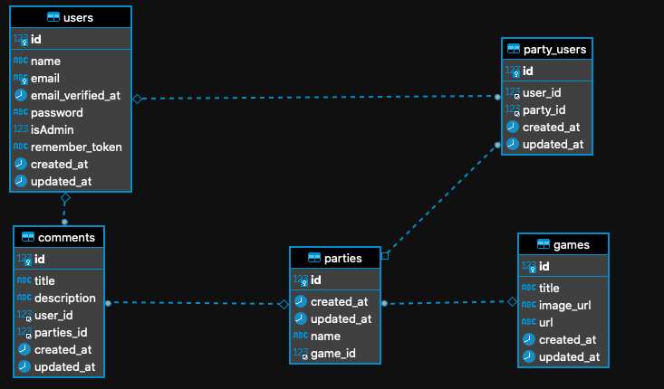

<p align="center"><a href="https://laravel.com" target="_blank"></a></p>

<p align="center">
<a href="https://travis-ci.org/laravel/framework"></a>
<a href="https://packagist.org/packages/laravel/framework"></a>
<a href="https://packagist.org/packages/laravel/framework"></a>
<a href="https://packagist.org/packages/laravel/framework"></a>
</p>

<a name="top"></a>

<h1>Chat  videogames App - Backend</h1>

🧐 [About](#id1)   

💻 [Technologys](#id2)

:clipboard: [Instructions](#id3)

⚙️ [Endpoints](#id5)


---

<a name="id1"></a>
## **About**

This is the backend for a chat aplication.

This project is part of the Full Stack Developer Bootcamp taught by [GeeksHubs Academy](https://bootcamp.geekshubsacademy.com/).

---
**Working time on the project**
**Start Date:** 05/ july /2021
**Deadline:** 19/ july / 2021

**Made by:**

* [Juan Felipe Porras Gallego](https://github.com/juanfegallego)

---

<a name="id2"></a>

## **Technologies**

These are the technologies with which we have worked in this project:
        


<a name="id3"></a>
***
## **Instructions**
<details>

<summary>Click to expand</summary>

<br>

- <b>To install all dependencies</b>
```
    $ composer install
```
</details> 

<a name="id4"></a>
## [Backend development](https://github.com/juanfegallego/Backend-PHP)


The project consists of the development of a chat in which players can talk about their favorite video games and share opinions.

The database that I have used is worked with DBeaver and later deployed in heroku

The frontend has these sections:

<a name="id5"></a>
## **Endpoints**
<details>

<summary>Click to expand</summary>


<br>

<b>USER</B>


Register

    POST /api/register 
Login

    POST /api/login --> Login a created user and returns a token

Show All Users (ONLY ADMIN)

    POST /api/users/all

<b>GAMES</B>

Create Game

     POST /api/game

Find game by ID

    GET /api/game/{ID}

Show all games

    GET /api/game


<b>COMMENT</B>

Create comment

    POST /api/comment 

<b>PartyUser</B>

Join the party

    POST api/partyUser/entry

<b>Models Relation</B>



</details>


<a name="id5"></a>

<a name="id6"></a>


***
[:top:](#top)